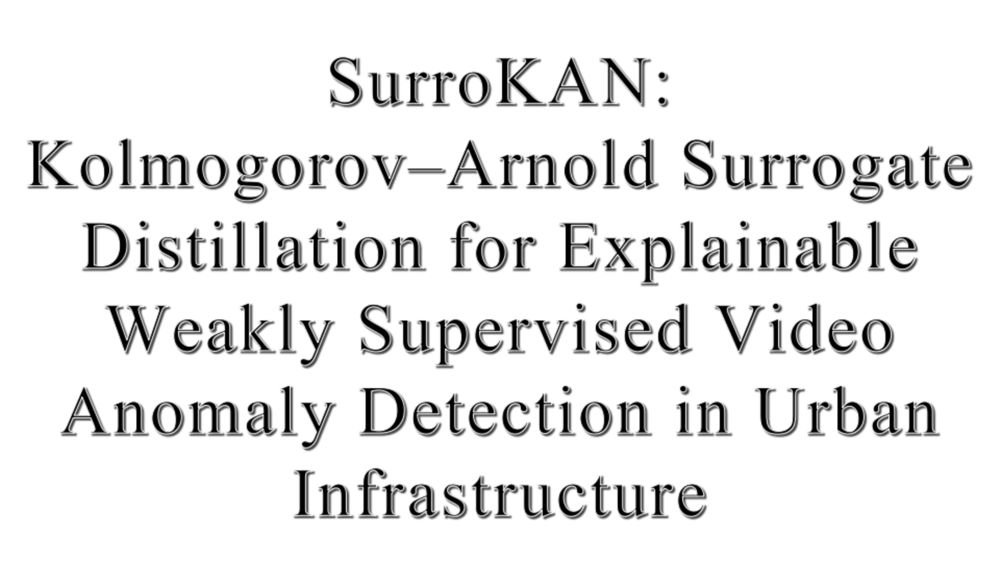
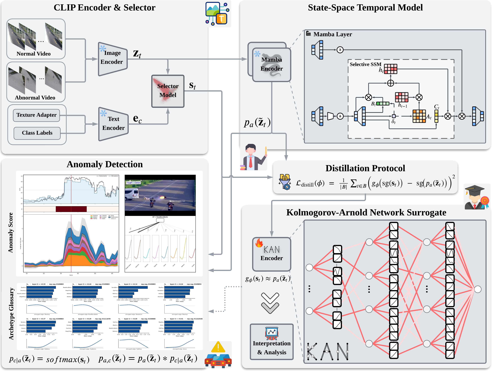

# SurroKAN

The source codes of "**SurroKAN: Kolmogorov–Arnold Surrogate Distillation for Explainable Weakly Supervised Video
Anomaly Detection in Urban Infrastructure**".

To cite this work:

```
@article{Li,
title = {SurroKAN: Kolmogorov–Arnold Surrogate Distillation for Explainable Weakly Supervised Video
Anomaly Detection in Urban Infrastructure},
journal = {Advanced Engineering Informatics},
volume = {},
pages = {},
year = {2026},
issn = {},
author = {Xiaowen Tao,Qingyuan Li,Yushun Lin,Yinuo Wang,Yuze Liu},
keywords = {Video Anomaly Detection,Kolmogorov–Arnold Network,Surrogate Distillation,Explainable Artificial Intelligence,Symbolic Regression,Urban Surveillance}
}
```

# Supplements

- Video that shows the AnomalyMamba performance on Handling the same exceptional scenario is more efficient.

  **Click to view the video:**

  <a href="https://youtu.be/NVZ2cJWpCsk" target="_blank">
  
  </a>

# Architecture

  
